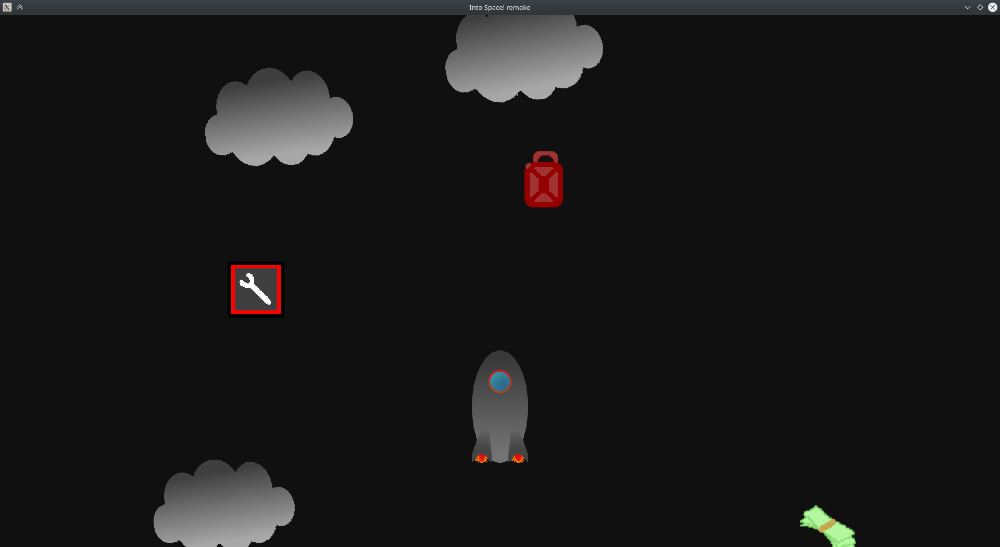

# Into Space! remake

This is a remake of the game Into Space! written in C++17 and OpenGL. Many components used in this project were separated into stand-alone libraries: [arg-parser](https://github.com/Stypox/arg-parser), [event-notifier](https://github.com/Stypox/event-notifier), [input-listener](https://github.com/Stypox/input-listener), [stock-container](https://github.com/Stypox/stock-container), [time-facilities](https://github.com/Stypox/time-facilities), [~~gl-abstractions~~](https://github.com/Stypox/gl-abstractions), [~~file-management~~](https://github.com/Stypox/file-management).

